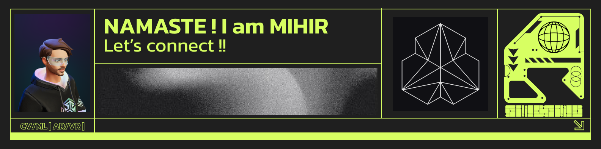

## Hi, I’m Mihir Mainkar

I work on software systems that are meant to be **run, maintained, and extended**, not just demonstrated.

My focus is on computer vision and real-time pipelines, often operating under practical constraints such as limited compute, latency budgets, and deployment requirements. I’m particularly interested in client-side inference, 3D perception, and systems that sit close to the user or the rendering loop.

This GitHub serves as a working lab. Repositories here reflect different stages of work — early prototypes, structured experiments, benchmarks, and production-ready pipelines. Where appropriate, projects include documentation, configuration, and deployment notes so others can understand decisions, reproduce results, and build on the work.

I value clarity in code, explicit assumptions, and finishing what is started. Most projects are shaped around making trade-offs visible rather than hiding complexity.

---

### Areas of focus
- Client-side and edge computer vision
- Real-time inference pipelines
- 3D perception and reconstruction
- Performance-aware ML systems
- Deployment-ready experimentation

---

### What you’ll find here
- Repositories with clear structure and scope
- Code written to be read by others
- Documentation that explains *why*, not just *what*
- Projects that prioritise correctness, reproducibility, and maintainability

---

### Selected work
Pinned repositories highlight systems that are either production-oriented or technically representative. Additional repositories may explore ideas, benchmarks, or intermediate research artifacts.

---

### Links
- Webfolio: https://bio.site/mihir.m  
- Contact: mainkar.mihir@gmail.com

### Hi there 👋, Welcome!

**Skills:**  
🚀 Computer Vision | AI & Machine Learning Engineer | Immersive Tech Developer | AR/VR/XR Innovator | HPC 

I’m a passionate Computer Vision expert with a strong background in AI, Machine Learning, and Immersive Technologies (AR/VR/MR).
I specialise in building intelligent systems that can see, understand, and interact with the world — 

bridging the gap between human vision 🧔🏽‍♂️ and machine intelligence 🤖.

**Tools:**   
     

    

  
 

- 👋 Hi, Welcome to @mihirm3hub
- 🌐 Webfolio: [https://bio.site/mihir.m](https://bio.site/mihir.m)
- 👀 I’m interested in Innovations
- 🌱 I’m currently researching [neural networks in NBV](https://github.com/mihirm3hub/sma-nbv-sim.git)
- 📫 How to reach me? > mainkar.mihir@gmail.com

<!--- 
&nbsp;
 --->
<!-- 
&nbsp;  -->
<!-- 
 
&nbsp;
  -->

<!---
mihirm3hub/mihirm3hub is a ✨ special ✨ repository because its `README.md` (this file) appears on your GitHub profile.
You can click the Preview link to view your changes.
--->
