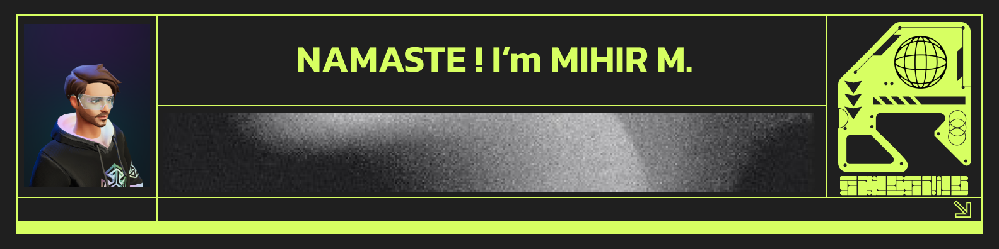

I work on software systems that are meant to be **run, maintained, and extended**.

My focus is on computer vision and real-time pipelines, often operating under practical constraints such as limited compute, latency budgets, and deployment requirements. I’m particularly interested in model tuning, 3D perception, and immersive systems.

This GitHub serves as a working lab. Repositories here reflect different stages of work — early prototypes, structured experiments, benchmarks, and production-ready pipelines. Where appropriate, projects include documentation, configuration, and deployment notes so others can understand decisions, reproduce results, and build on the work.

I value clarity in code, explicit assumptions, and finishing what is started. Most projects are shaped around making trade-offs visible rather than hiding complexity.

---
| First Header  | Second Header |
| ------------- | ------------- |
| Content Cell  | Content Cell  |
| Content Cell  | Content Cell  |
### Areas of focus
- Computer vision
- Real-time inference pipelines
- 3D perception and reconstruction
- Performance-aware ML systems
- Deployment-ready experimentation

---
**Languages:**   

      

**Tools:**   

      

**DevOps:**  

    

---
### Selected work
Pinned repositories highlight systems that are either production-oriented or technically representative. Additional repositories may explore ideas, benchmarks, or intermediate research artefacts.

---

### Links
 &nbsp;
 &nbsp;

 
<!---
mihirm3hub/mihirm3hub is a ✨ special ✨ repository because its `README.md` (this file) appears on your GitHub profile.
You can click the Preview link to view your changes.
--->
