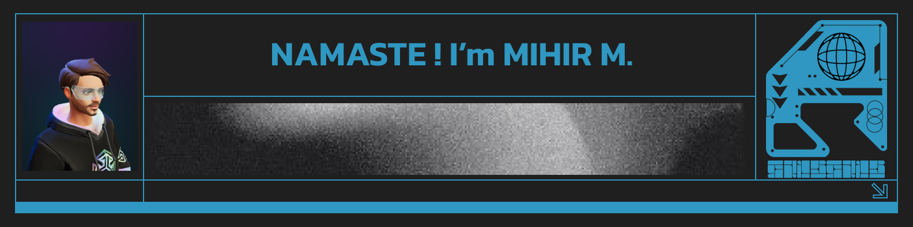

I work on production-minded computer vision and real-time systems.  
Repositories here range from exploratory experiments to deployable pipelines.

---
### Stack
<table>
  <tr>
    <th align="left">Languages</th>
    <th align="left">Tools</th>
    <th align="left">DevOps</th>
  </tr>
  <tr>
    <td>
      
      
      
      
    </td>
    <td>
      
      
      
      
    </td>
    <td>
      
      
      
    </td>
  </tr>
</table>

---
### Stats

---
### Links
 &nbsp;
 &nbsp;

---
### Selected repositories
(handled by GitHub pinned section) 👇
<!---
mihirm3hub/mihirm3hub is a ✨ special ✨ repository because its `README.md` (this file) appears on your GitHub profile.
You can click the Preview link to view your changes.
--->
